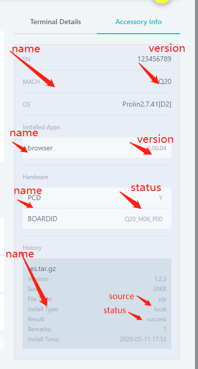

# PAXSTORE Install Inquirer Integration


By integrating with this function, your application will be able to sync accessory information to PAXSTORE cloud.
##### See the example picture below:



#####  Sample code:

```
private void syncAccessoryInfo() {
        List<TerminalSyncInfo> infoList = new ArrayList<>();
        TerminalSyncInfo item1 = new TerminalSyncInfo();
        item1.setType(SyncApi.SyncType.DEVICE);
        item1.setName("SN");
        item1.setVersion("123456789");
        infoList.add(item1);

        TerminalSyncInfo item2 = new TerminalSyncInfo();
        item2.setType(SyncApi.SyncType.DEVICE);
        item2.setName("MACH");
        item2.setVersion("Q20");
        infoList.add(item2);


        TerminalSyncInfo item3 = new TerminalSyncInfo();
        item3.setType(SyncApi.SyncType.APPLICATION);
        item3.setName("browser");
        item3.setVersion("2.00.04");
        infoList.add(item3);


        TerminalSyncInfo item4 = new TerminalSyncInfo();
        item4.setType(SyncApi.SyncType.HARDWARE);
        item4.setName("PCD");
        item4.setStatus("Y");
        infoList.add(item4);

        TerminalSyncInfo item5 = new TerminalSyncInfo();
        item5.setType(SyncApi.SyncType.HARDWARE);
        item5.setName("BOARDID");
        item5.setStatus("Q20_M06_P00");
        infoList.add(item5);

        TerminalSyncInfo item6 = new TerminalSyncInfo();
        item6.setType(SyncApi.SyncType.INSTALL_HISTORY);
        item6.setName("res.tar.gz");
        item6.setInstallTime(System.currentTimeMillis());
        item6.setVersion("1.2.3");
        item6.setFileSize(20 * 1024L);
        item6.setFileType("zip");
        item6.setSource("local");
        item6.setStatus("success");
        item6.setRemarks("1");
        infoList.add(item6);


        TerminalSyncInfo item = new TerminalSyncInfo();
        item.setType(SyncApi.SyncType.DEVICE);
        item.setName("OS");
        item.setVersion("Prolin2.7.41[D2]");
        infoList.add(item);

        try {
            SdkObject sdkObject = StoreSdk.getInstance().syncApi().syncTerminalInfo(infoList);
            Log.e("MainActivity", "sdkObject.getBusinessCode():" + sdkObject.getBusinessCode());
        } catch (NotInitException e) {
            e.printStackTrace();
        }
    }
```

#### Multiple ancillary equipments

If the terminal has more than one ancillary equipment, you need to submit only one ancillary equipment information at a time.
And include the SN of all ancillary equipments, that is, you need to bring the following dto every time you submit an ancillary equipment information

```
TerminalSyncInfo item0 = new TerminalSyncInfo();
item0.setType(SyncApi.SyncType.DEVICE);
item0.setName("SN_LIST");
item0.setVersion("SN123,SN456,SN789");
infoList.add(item0);
```

For more detail, please refer to [this](SyncApi.md)
